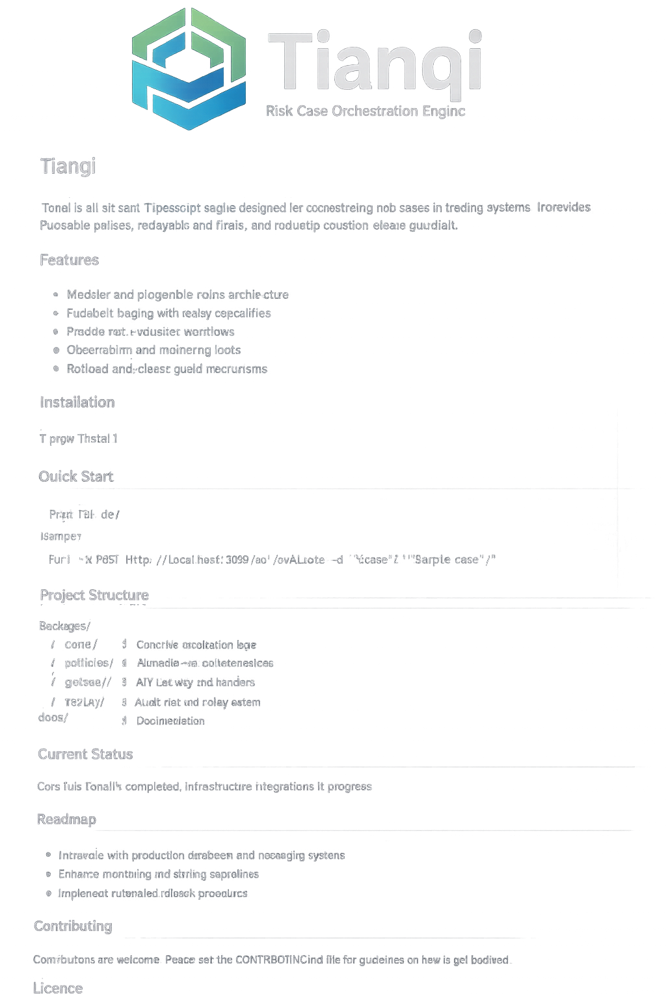

Tianqi

  

  <strong>An elegant TypeScript engine for risk-case orchestration, replayable auditing, observability, and production release guardrails.</strong>

  
  
  
  
  

⸻

What is Tianqi?

Tianqi is a modular TypeScript system for risk-case processing in trading scenarios. It is designed around a strict architecture:
	•	Phase 1 builds the project skeleton and contracts.
	•	Phase 2 establishes the core case flows.
	•	Phase 3 adds pluggable policy selection and configuration versioning.
	•	Phase 4 introduces application-layer orchestration, saga semantics, idempotency, and external adaptation boundaries.
	•	Phase 5 adds replayable audit storage, case reconstruction, and replay consistency.
	•	Phase 6 adds tracing, metrics, benchmark harnesses, and structured fault drills.
	•	Phase 7 adds production release guardrails, contract freeze baselines, rollback plans, and runbook readiness.

The project emphasizes four principles:
	1.	Decision and execution are separated.
	2.	Every meaningful state transition is auditable and replayable.
	3.	Policies are versioned, pluggable, and validated before activation.
	4.	Release readiness is treated as a first-class engineering concern.

⸻

Highlights

Core case system
	•	RiskCase, LiquidationCase, and ADLCase minimal domain models
	•	explicit state transitions and transition guards
	•	structured audit records for creation, transition, coordination, and resolution

Policy engine
	•	pluggable RankingPolicy, FundWaterfallPolicy, and CandidateSelectionPolicy
	•	policy descriptors with type / name / version identity
	•	policy bundle resolution, prevalidation, and dry-run
	•	configuration version activation and rollback

Orchestration
	•	RiskCase and LiquidationCase orchestration paths
	•	saga skeleton with compensation planning
	•	idempotency guards and replayed-result handling
	•	audit-event publishing through explicit ports

Audit and replay
	•	append-only audit event store boundary
	•	single-case replay and batch replay
	•	case reconstruction skeleton
	•	replay baseline snapshots and replay acceptance pipeline

Observability and drills
	•	structured trace context propagation
	•	metrics contract and in-memory metrics sink
	•	benchmark harness for key paths
	•	fault-injection scenarios for timeout, duplicate, out-of-order, and partial-write conditions

Production guardrails
	•	publish preflight checks
	•	contract freeze baseline
	•	rollback plan skeleton
	•	runbook and incident-manual readiness
	•	release gate, final acceptance, and close-decision flow

⸻

Architecture

Tianqi follows a layered monorepo design.

Tianqi
├─ packages/
│  ├─ contracts/      # shared error codes and published contract boundaries
│  ├─ shared/         # identifiers and common primitives
│  ├─ domain/         # domain models, state machines, and invariants
│  ├─ ports/          # repository and infrastructure-facing interfaces
│  ├─ policy/         # pluggable strategies and config versioning
│  └─ application/    # orchestration, replay, observability, release guards
├─ docs/
│  ├─ phase1/ ... phase7/
│  └─ 00-phase1-mapping.md
├─ package.json
├─ pnpm-workspace.yaml
└─ vitest.config.ts

Layering rules
	•	Domain contains business state, transitions, and invariants.
	•	Policy contains strategy contracts, descriptors, bundles, config versions, and activation logic.
	•	Application coordinates use cases, orchestration, replay, observability, and release readiness.
	•	Ports define all external collaboration boundaries.
	•	Infrastructure is intentionally thin and can be attached later via adapters.

⸻

Repository status

This repository is the result of a multi-phase build-out and freeze process.

Current status
	•	Core architecture: complete
	•	Test suite: extensive
	•	Replayability: built in
	•	Observability spine: built in
	•	Release guardrails: built in

Important scope note

Tianqi is production-architecture complete, but some integrations remain intentionally adapter-based or in-memory by design.

That means the repository is well-suited for:
	•	architecture review
	•	collaboration and extension
	•	local development and test environments
	•	GitHub publication and open-source presentation

For real production deployment, teams should still wire in:
	•	persistent storage implementations
	•	external configuration center integration
	•	release automation integration
	•	real monitoring/alerting backends
	•	deployment secrets and environment management

⸻

Getting started

Requirements
	•	Node.js 20+
	•	pnpm 9+

Install

pnpm install

Type check

pnpm typecheck

Lint

pnpm lint

Test

pnpm test

Run all core checks

pnpm lint && pnpm typecheck && pnpm test

⸻

Design goals

Tianqi was built to make complex risk-processing systems easier to reason about.

1. Strong contracts

Everything important is explicit:
	•	identifiers
	•	policy descriptors
	•	command models
	•	result models
	•	error codes
	•	event schemas

2. Replayability by construction

Any state-changing path should leave behind enough information to:
	•	audit what happened
	•	replay what happened
	•	compare expected and reconstructed outcomes

3. Safe extensibility

New strategies, adapters, or execution paths should be introducible without rewriting core semantics.

4. Release safety

Configuration changes, contract drift, rollback readiness, and operational runbooks should all be checked before release.

⸻

Example capability map by phase

Phase	Theme	Main outcome
1	Skeleton	contracts, packages, baseline structure
2	Core case flows	RiskCase / LiquidationCase / ADLCase flows
3	Pluggable policies	policy contracts, bundles, config versioning
4	Execution orchestration	orchestrators, saga skeleton, idempotency
5	Audit & replay	event store, replay, reconstruction, replay checks
6	Observability & drills	trace, metrics, benchmarks, fault drills
7	Production guardrails	preflight, contract freeze, rollback, runbook

⸻

Testing philosophy

Tianqi is built with regression-friendly engineering in mind.

The test suite is intended to validate:
	•	domain transition legality
	•	policy bundle resolution correctness
	•	orchestration and replay semantics
	•	trace/metrics/benchmark consistency
	•	fault drill handling
	•	release preflight and close-decision logic

The project favors:
	•	explicit invariants
	•	structured results over implicit behavior
	•	regression baselines and gate-style checks
	•	documentation synchronized with implementation changes

⸻

What Tianqi is not

Tianqi is not currently:
	•	a ready-made UI product
	•	a cloud-hosted SaaS
	•	a full infra platform
	•	a finalized production deployment template
	•	a complete CI/CD release service

It is a high-discipline core engine and architecture base designed to make those layers safer to build.

⸻

Roadmap after project freeze

The seven planned phases are complete. Future work, if any, should be treated as post-freeze evolution rather than phase continuation.

Reasonable follow-up directions include:
	•	persistent adapters for event storage and metrics
	•	external configuration center integration
	•	real rollback execution adapters
	•	production deployment templates
	•	operational dashboards and alerting
	•	broader policy libraries

⸻

Contributing

Contributions are welcome, but changes should preserve the project’s architectural discipline.

Please keep these rules in mind:
	•	do not bypass explicit ports
	•	do not blur domain, policy, and application responsibilities
	•	do not introduce incompatible contract drift casually
	•	add tests and docs for meaningful behavior changes
	•	keep risk, rollback, and compatibility implications explicit

⸻

License

This project is released under the MIT License.

⸻

Project description

An elegant TypeScript engine for risk-case orchestration, replayable auditing, observability, and production release guardrails.
